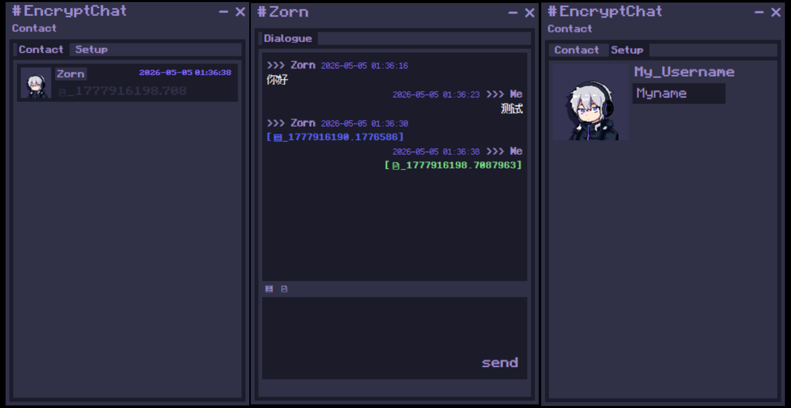
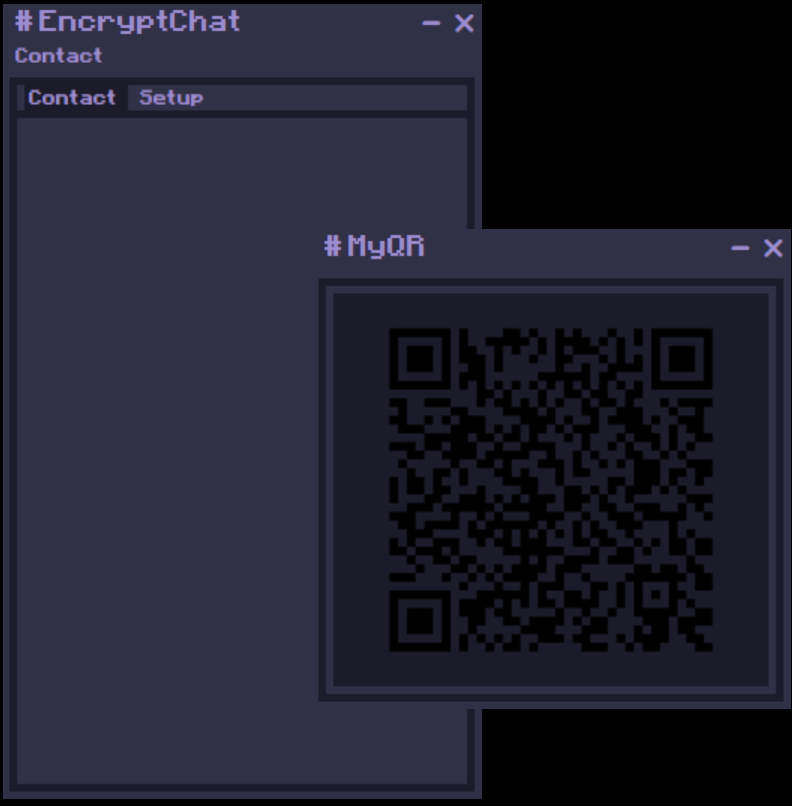

# ZornChat-E2EE
End-to-end E2EE encryption, zero server storage for chat history/contact list, supports text/image/file P2P transmission, local encrypted storage, offline message queue, privacy-focused traceless communication
端到端 E2EE 加密、服务器零存储聊天记录 / 联系人、支持文字 / 图片 / 文件点对点传输、本地加密存储、离线消息队列、隐私无痕通信

# ZornChat 加密通信项目说明 | ZornChat Encrypted Communication Project Description
## 📌 项目简介 | Project Introduction
端到端加密私密通信工具，采用现代密码学算法架构，服务端仅做消息中转与身份校验，**不存储聊天记录、联系人、用户隐私数据**，全程本地加密、点对点安全通信。
An end-to-end encrypted private communication tool, adopting a modern cryptography algorithm architecture. The server only forwards messages and verifies identities, **does not store chat records, contacts, or user privacy data**, and achieves full local encryption and point-to-point secure communication.

## 🏗 整体架构设计 | Overall Architecture Design
- 服务端基于 HMAC-SHA512 生成身份指纹，实现服务器身份可信校验，支持密钥自动轮换与闲置指纹清理。
- The server generates identity fingerprints based on HMAC-SHA512 to achieve trusted server identity verification, supporting automatic key rotation and cleanup of idle fingerprints.
- 采用**公钥哈希**作为全局唯一身份标识，服务端仅维护公钥哈希与在线套接字映射、加密离线消息队列。
- Uses **public key hash** as the globally unique identity, and the server only maintains the mapping between public key hashes and online sockets, as well as encrypted offline message queues.
- 离线消息加密存储，默认7天自动过期清理，规避长期数据泄露风险。
- Offline messages are stored encrypted, with automatic expiration and cleanup after 7 days by default to avoid long-term data leakage risks.
- 所有本地密钥、聊天记录、图片文件、普通文件均**全程加密落盘**，依赖系统安全硬件级密钥容器保管主密钥。
- All local keys, chat records, image files, and ordinary files are **encrypted and stored on disk throughout the process**, relying on the system's secure hardware-level key container to store the master key.

## 🔐 身份与通信安全机制 | Identity and Communication Security Mechanism
- 基于 X25519 椭圆曲线生成非对称密钥对，私钥本地隔离存储，永不上传服务端。
- Generates asymmetric key pairs based on the X25519 elliptic curve; the private key is stored in isolation locally and never uploaded to the server.
- 公钥经 SHA-256 哈希作为身份唯一标识，本地自主核验公钥指纹，线下二维码交叉认证，防御中间人攻击。
- The public key is hashed via SHA-256 as the unique identity; public key fingerprints are verified locally, and offline QR code cross-authentication is used to defend against man-in-the-middle attacks.
- 单次会话随机生成 AES-256-GCM 会话密钥，采用 X25519+ECIES 密钥封装，保障前向保密。
- A random AES-256-GCM session key is generated for each session, encapsulated via X25519+ECIES to ensure forward secrecy.
- 消息自带时间戳与防重放序号，接收端完整性校验，篡改、过期消息直接拦截丢弃。
- Messages include timestamps and anti-replay serial numbers; the receiver performs integrity verification, and tampered or expired messages are directly intercepted and discarded.
- 陌生非联系人消息默认屏蔽，仅保留本地双向认证后的联系人通信权限。
- Messages from unfamiliar non-contacts are blocked by default, only retaining communication permissions for contacts with local two-way authentication.

## ⚙️ 核心密码学与编码算法 | Core Cryptography and Encoding Algorithms
### 1. 哈希与签名算法 | Hash and Signature Algorithms
- HMAC-SHA512：服务端身份指纹生成、接口合法性校验
  - HMAC-SHA512: Server identity fingerprint generation and interface validity verification
- SHA-256：公钥摘要哈希、用户唯一身份标识
  - SHA-256: Public key digest hash and user unique identity

### 2. 非对称密钥算法 | Asymmetric Key Algorithm
- X25519：椭圆曲线密钥协商，配合 ECIES 完成会话密钥加密封装
  - X25519: Elliptic curve key agreement, combined with ECIES to complete session key encryption and encapsulation

### 3. 对称加密算法 | Symmetric Encryption Algorithm
- AES-256-GCM：标准 AEAD 认证加密，用于聊天消息、本地配置、图片、文件全量加密；兼具加密、完整性校验、防篡改、防重放能力
  - AES-256-GCM: Standard AEAD authenticated encryption, used for full encryption of chat messages, local configurations, images, and files; with encryption, integrity verification, tamper-proof, and anti-replay capabilities

### 4. 编码与压缩规范 | Encoding and Compression Specifications
- Base64：密钥、二进制图片/文件数据通用序列化编码
  - Base64: General serialization encoding for keys and binary image/file data
- 传输层：禁止加密前压缩，规避 CRIME/BREACH 侧信道攻击
  - Transport layer: Compression before encryption is prohibited to avoid CRIME/BREACH side-channel attacks
- 存储层：默认 Zstandard(zstd) 压缩，兼顾压缩率与性能，固定策略不频繁切换
  - Storage layer: Zstandard (zstd) compression by default, balancing compression ratio and performance with a fixed strategy that does not switch frequently

## 💾 本地存储规范 | Local Storage Specifications
- 图片、文件以时间戳命名独立落盘，通过加密索引表与聊天记录关联绑定。
  - Images and files are stored separately on disk named by timestamp, associated with chat records through an encrypted index table.
- 所有聊天记录、联系人表、文件图片索引均以加密结构化格式本地存储，后续优化行式存储降低内存占用。
  - All chat records, contact lists, and file/image indexes are stored locally in an encrypted structured format; subsequent optimization to line-based storage to reduce memory usage.

 
## 🧾 基础用法说明 | Basic Usage Instructions
- 你可以通过左上角的“Contact”按钮来展示自己的二维码或添加别人的二维码
  - You can display your own QR code or add someone else's QR code through the "Contact" button in the upper left corner
- 你可以点击“Setup”界面的头像来更改它，还有修改自己的用户名，注意这个用户名是明文的
  - You can click on the avatar on the "Setup" interface to change it, as well as modify your own username. Please note that this username is in plain text
- 输入框上方的两个按钮分别表示图像和文件的上传发送
  - The two buttons above the input box represent the upload and send of images and files, respectively

## ⚠ 注意事项 | Precautions
- windows系统中如果设置了界面缩放，添加联系人时程序UI可能突然变化，重启软件后恢复。
  - If interface scaling is set in the Windows system, the UI of the program may suddenly change when adding contacts. After restarting the software, it will be restored.
- 大多数涉及信息的UI更新，包含对方的头像，对方的用户名，都需要对方和自己先后重新登录过一次之后才能看到。
  - Most UI updates involving information, including the other party's avatar and username, require both the other party and oneself to log in again before they can be viewed.
- 如果密钥已经泄露，最简单的方式就是删掉所有的配置文件然后重启，不过好友信息不会保留，哪怕你留下联系人文件也一样，因为你的公钥变了，对方收不到你的信息。
  - If the key has been leaked, the simplest way is to delete all configuration files and restart, but friend information will not be retained, even if you leave contact files, because your public key has changed and the other party cannot receive your information.
- 私钥是明文储存在chat_config目录中的，因为其他文件都间接或直接依赖它加密，所以没有东西来加密它。我知道很不安全，但是我相信你会有办法的。
  - The private key is stored in plaintext in the chat_comfig directory, as other files rely indirectly or directly on it for encryption, so there is nothing to encrypt it. I know it's not safe, but I believe you will find a way.
    

